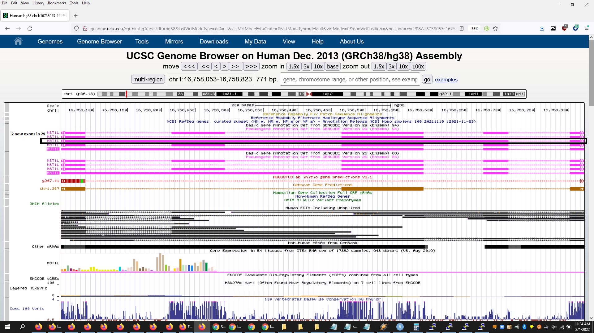
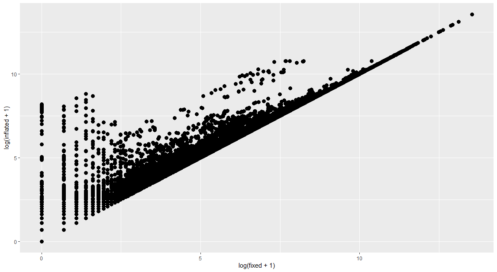

# Fixes Since Release (latest first)

## Rejoin gene collision fix (2022-02-19)

This has been fixed as of 2022-02-19.
All human studies affected were fixed (all annotations) on or before 2022-02-19.
Given that Mouse only had one gene affected (see below), it was not fixed and remains inflated.

Due to a bug in the rejoin code in the recount/monorail unifier there are a subset of genes in each of the 4 human annotations that have inflated raw counts.  Exon and junction counts are fine. Only one gene was affected in Mouse (`ENSMUSG00000074994.5` inflated by 1 exon).

List of genes affected by study for all human annotations:

http://stingray.cs.jhu.edu/data/recount3_rejoin_fix_notes/all_studies.genes_affected.final.tsv.gz

We strongly urge anyone using recount3 to flush their cache (if not done already after 2022-02-19) and re-run any analyses that involved the affected human genes in the affected studies in recount3 (does not affect exon or junction level counts):

`recount3_cache_rm()`

Anyone running Monorail on their own samples should see the main https://github.com/langmead-lab/monorail-external for the exact unifier image to re-run the unifier step to fix this.


The following is the maximum number of genes affected for each human annotation (this varies depending on the study):

```
RefSeq R109 2590
Gencode26 G026 1798
Gencode29 G029 1365
FANTOM6 F006 80
```

The issue was that the unifier's rejoin code used coordinates + strand to match disjoint exons against original gene annotation rather than including the gene name.  This leads to a key collision between genes which have the exact same start+end+strand but different exons. Duplicate exons will not be double counted, but exons with different start/end coordinates will artificially inflate the total gene's coverage sum.  Because we ran 4 annotations together in human the problem was exacerbated due to exact coordinate matches across closely related annotations (e.g. G026 vs. G029 having many of the same gene extents but different exons).  R109 is RefSeq and has the highest number likely due to it having smaller transcripts than Gencode, while FANTOM likely has larger genes and different starts/ends and is therefore less affected.

An illustrative example between Gencode 29 and Gencode 26, 29 has 2 additional exons not matching any in 26 which will lead to potential inflation of the gene in 26's sum:



using bodymap2.0 (ERP000546) we scatter plotted the inflation using log(transformed_counts+1) for every affected gene-sample pair



corrected ("fixed") sums are on the x-axis, existing ("inflated") sums on the y-axis

## recount3 Mouse (GRCm38) Exon Annotation Mislabeling (2022-02-19)

This has been fixed as of 2022-02-19.

This only applies to the public recount3 mouse exon annotation GTF.

We strongly suggest anyone using recount3 flush their cache (if not done already after 2022-02-19) and re-run any analyses that involved mouse exons from recount3 (does not apply to mouse gene level counts):

`recount3_cache_rm()`

There were ~5500 exons in the mouse exon annotation GTF in recount3 which are miss-assigned to the wrong gene in the annotation file resulting in an exon being assigned twice to the same gene while the correct gene will not have that exon in the annotation file. Beyond those ~5500, there appeared to be many mislabelings of protein, transcript and exon IDs and related information (biotype, support level, exon number). The counts themselves should be fine as well as the gene level annotation, and this only affects the exons for mouse (not human or other organisms).

## Unifier gene ordering fix (2022-02-19)

This has been fixed as of 2022-02-19.

This bug should only affect users who are applying Monorail to their own samples *and* using their own internal recount3 with annotations.

With the 1.1.0 version of the Unifier image, the order of genes produced for all annotations all organisms may change to what's expected by the recount3 gene annotation order causing this error (this could also have happened with earlier unifier images):

`Gene names and count rownames are not matching.`

Users should update their Unify image to 1.1.0 (or later) and ensure they have the additional gene-order reference files for their organism:

https://github.com/langmead-lab/monorail-external/blob/646c59124d546da63cbb73356273bb174b2a63ea/get_unify_refs.sh#L52

## Unifier exon ordering fix (2021-02-08)

A bug was discovered in the Unifier (a.k.a. recount-unify, aggregation) portion of Monorail that affects the aggregation of exon sums into per-study counts loadable with the recount3 package in R/Bioconductor.  This does *not* affect gene or junction counts or Snaptron-related output, nor does this affect the recount-pump (alignment) stage of the processing.

The public recount3 exon sums are correct and the Unifier source code and containers have been fixed as of version 1.0.4.

However, this required a change to the ordering of the final set of exon rows in the per-study exon sum files and related annotation files for 3rd party studies processed by monorail-external (this repo).

These are no longer the same ordering as what's in the current recount3 data release. 

Therefore care must be taking if 3rd party studies' exon sums, run through the Unifier containers associated with this repo (versions >=1.0.4), are compared directly against the current recount3 data release;s exon sums.  The order of exon features/rows will *not* be the same, so a simple `cbind` operation will not work in R.  A reordering of one or both RSE will be required to make them directly `cbind`able.

Any per-study exon sums from 3rd party studies run through the Unifier prior to 1.0.4 should be discarded and not used (not applicable to Snaptron's exon sums).
